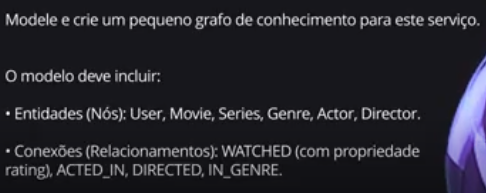
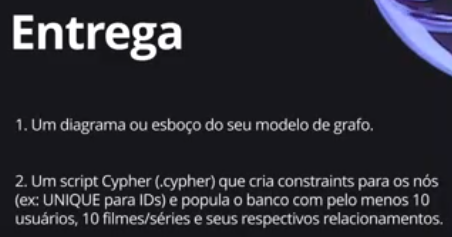

<p>
  <div align="right"> 
<a href="./readme.md"> </a><a href="./leiame.md">  </a>
</div>
  <H1><b> Victor Sérgio Silva Barros </b> </H1>
  
</p> 


# Neo4j - Data Analysis with Graphs Training

This repository contains materials and exercises related to the Neo4j - Data Analysis with Graphs training offered by [DIO](https://web.dio.me/track/neo4j-analise-de-dados-com-grafos).

## Description

The Neo4j - Data Analysis with Graphs training aims to train professionals in the use of graph databases for data analysis, covering everything from basic concepts of graph theory to advanced querying and analytics techniques using Neo4j. This bootcamp emphasizes practical applications in areas such as social networks, fraud detection, and recommendation systems.

## Challenge: Data Modeling in Graphs for a Streaming Service

This repository implements the project challenge from the Neo4j - Data Analysis with Graphs training, focusing on designing and implementing a graph database schema for a streaming service (similar to Netflix or similar platforms). The challenge demonstrates how graph databases can effectively model complex relationships in entertainment data, enabling advanced analytics, personalized recommendations, and efficient querying.

### Objectives
- Apply graph data modeling principles using Neo4j to represent streaming service entities and their relationships.
- Design a comprehensive graph schema that captures user interactions, content metadata, and platform details.
- Implement data import, querying, and analysis using Cypher.
- Showcase the advantages of graph databases for recommendation systems and relationship-based analytics.

### Key Components
- **Entities (Nodes)**:
  - **User**: Properties include ID, name, email, and subscription type.
  - **Movie/Series**: Properties include ID, title, release year, duration, and rating.
  - **Actor**: Properties include ID, name, and birthdate.
  - **Director**: Properties include ID and name.
  - **Genre**: Properties include ID and name.
  - **Platform/Device**: Properties include ID and type (e.g., mobile, TV).

- **Relationships**:
  - `User WATCHED Movie` (with properties: date watched, user rating, time watched).
  - `Actor ACTED_IN Movie`.
  - `Director DIRECTED Movie`.
  - `Movie BELONGS_TO Genre`.
  - `User SUBSCRIBED_TO Platform`.
  - `Movie SIMILAR_TO Movie` (for recommendation algorithms).

### Implementation Details
- **Data Import**: Utilizes Cypher LOAD CSV commands to populate the graph with sample data.
- **Queries and Analytics**: Includes Cypher queries for user viewing history, content recommendations based on user similarities or genres, actor collaboration analysis, and genre popularity metrics.
- **Tools Used**: Neo4j Desktop or AuraDB, Cypher query language, and optional Python scripting with neo4j-driver.
- **Best Practices**: The model adheres to Neo4j conventions, ensuring scalability, normalization, and efficient traversals.

### Visual Schema
The following diagrams illustrate the graph schema designed for this challenge:





These images provide a visual representation of the nodes, relationships, and properties in the streaming service data model.

## Prerequisites

- Basic programming knowledge (e.g., Python, Java, or JavaScript)
- Basic understanding of databases and data structures
- Familiarity with command-line tools or IDEs like VS Code
- Proficiency in Portuguese (as the bootcamp materials are in Portuguese)

## How to Use

1. Clone this repository:
    ```sh
    git clone https://github.com/your-username/your-repository.git
    ```
2. Navigate to the project directory:
    ```sh
    cd your-repository
    ```
3. Follow the instructions in each module to run the examples and exercises.

## License

This project is licensed under the MIT License. See the [LICENSE](LICENSE) file for more details.

## Versioning

1.0.0

## Author

* **Victor Sérgio Silva Barros**:

<p align="left">
  <a href="mailto:vicssb@gmail.com" alt="Gmail" target="_blank">
  </a>

  <a href="https://www.linkedin.com/in/victor-sergio-silva-barros/" alt="Linkedin" target="_blank">
  </a>

  <a href="https://wa.me/+5512981328278" alt="WhatsApp" target="_blank">
  </a>

</p>

<p>Please follow GitHub and join us!
Thanks for visiting and happy coding!</p>